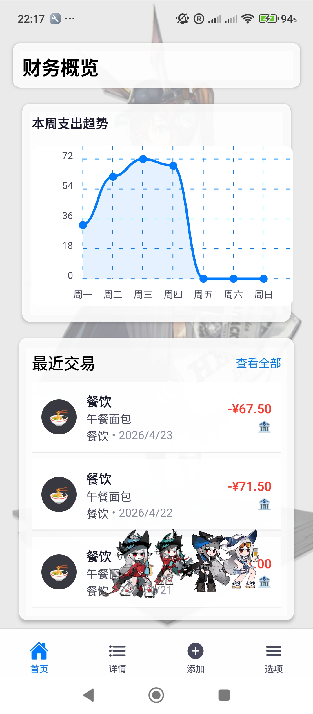
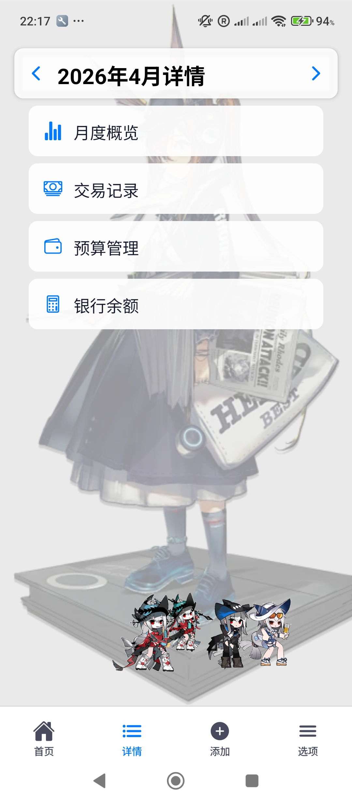
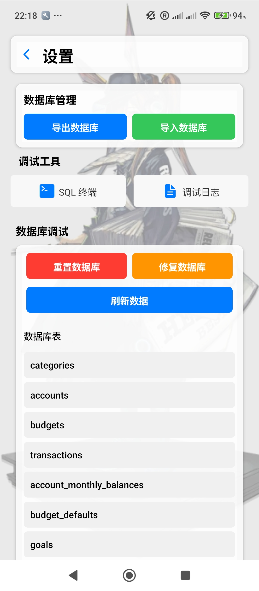
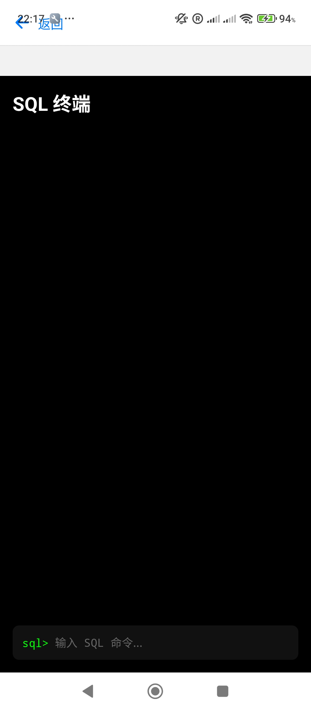
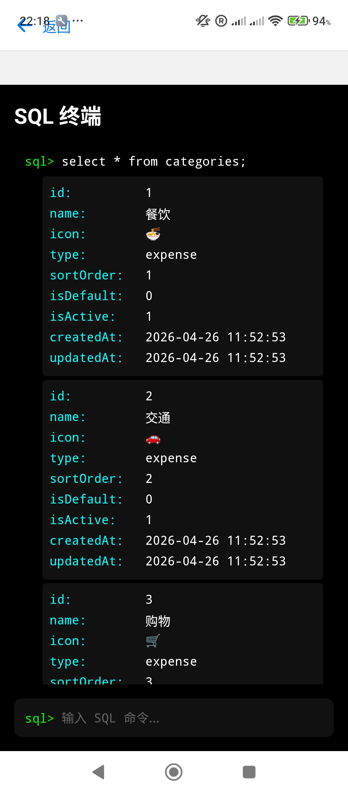

# 财务管理助手

一个简单易用的个人财务管理应用，帮助您追踪日常收支、管理预算和分类支出。

## 关于本项目模板

本项目是一个面向个人开发者的财务管理应用模板。你可以直接在此基础上进行二次开发，无需担心项目结构、DDD（领域驱动设计）分层或文件夹组织等问题。所有基础架构和目录结构都已为你设计好，方便你专注于实现自己的业务逻辑和界面需求，快速搭建属于你的财务管理工具。

## 界面展示

### 主页界面
<table>
<tr>
<td></td>
<td></td>
</tr>
</table>

### 调试界面和数据库管理
<table>
<tr>
<td></td>
<td></td>
<td></td>
</tr>
</table>

## 主要功能

### 1. 交易管理
- 记录日常收入和支出
- 支持按日期、金额、分类筛选交易记录
- 查看交易历史记录和统计

### 2. 预算管理
- 设置月度预算
- 按分类设置预算限额
- 实时监控预算使用情况
- 预算超支提醒

### 3. 分类管理
- 自定义收入和支出分类
- 灵活调整分类结构
- 支持分类图标和颜色设置

### 4. 数据可视化
- 周度支出趋势图表
- 分类支出占比分析
- 预算执行情况图表

### 5. 数据安全
- 本地数据存储
- 数据备份和恢复
- 隐私保护  

### 6. Web 模式（局域网访问）

应用内置一个轻量级 HTTP 服务器（基于 [NanoHTTPD](https://github.com/NanoHttpd/nanohttpd)）。打开后，手机会在 LAN 上托管完整的 Web 版应用，任何同 Wi-Fi 下的浏览器都能扫码或输入 URL 访问、实时编辑数据，无需切换应用或安装 Termux。

**怎么用：**
- 设置 → **Web 模式** → 打开开关
- 手机会显示一个 URL（含 PIN，例如 `http://192.168.x.x:8080/?token=1234`）和二维码
- 任何同 Wi-Fi 的浏览器扫码或输入 URL 即可访问
- 浏览器里所有改动通过 REST API 写入本机 SQLite，原生应用自动同步刷新
- 关闭开关后服务立即停止；切到后台超过 5 分钟也会自动停止以省电，回到前台自动重启

**架构：**
- 原生侧：Kotlin 的 `FinanceHttpServer`（`android/.../webserver/`）从 APK 内嵌的 `assets/web/` 提供 Expo Web 打包产物，并暴露 `/api/*` REST 端点代理到同一个 SQLite 文件
- Web 侧：`WebDatabase`（`services/database/web/WebDatabase.ts`）拦截 SQL 调用，转成对原生 HTTP 服务的 REST 请求；`useDatabaseSetup.web.ts` 启动时从 URL 的 `?token=` 拿到 PIN 并设为 Bearer 头
- 两者共享同一份 `FinanceManager.db` —— 浏览器写的，原生立刻能看见；原生写的，浏览器刷新就能看见

**安全：** PIN 每次开关都重新生成，不广播；服务只在本机 0.0.0.0 监听，不出公网。

**开发构建小贴士：** 修改了 Web 模式相关代码后，需要重新导出 Web bundle 并嵌入到 APK 中（gradle 不会自动做这步）：

```bash
bash scripts/build-web.sh   # git-bash / Linux / Mac
# 或 PowerShell：
#   Remove-Item dist -Recurse -Force
#   npx expo export --platform web
#   Remove-Item android\app\src\main\assets\web -Recurse -Force
#   Copy-Item dist android\app\src\main\assets\web -Recurse -Force
```

然后再 `npm run android` 重新打 APK。详见 [`docs/DEBUG.md`](docs/DEBUG.md) 的「When do I need to rebuild the web bundle?」一节。

完整使用说明与故障排查见 [`docs/DEBUG.md`](docs/DEBUG.md)。

## 使用指南

### 添加交易
1. 点击底部导航栏的"+"按钮
2. 选择交易类型（收入/支出）
3. 输入金额和选择分类
4. 添加备注（可选）
5. 点击保存

### 设置预算
1. 进入"设置"页面
2. 选择"预算管理"
3. 点击"添加预算"
4. 设置预算金额和分类
5. 点击保存

### 管理分类
1. 进入"设置"页面
2. 选择"分类管理"
3. 点击"添加分类"
4. 设置名称、类型和图标
5. 点击保存

## 隐私说明
- 所有数据仅存储在您的设备本地
- 不会收集任何个人信息
- 不会上传任何数据到服务器

## 支持
Mentally Support

## 开发者提示

完整开发流程、env vars、logcat 过滤器、Web 模式测试步骤、常见故障见 [`docs/DEBUG.md`](docs/DEBUG.md)。

### Web 模式构建

Web 模式需要在 Android APK 中捆绑 Expo 的 Web 构建产物。推荐流程：

```powershell
# 1. 生成 web bundle
npx expo export --platform web --output-dir dist

# 2. 复制到 APK 资产目录
Remove-Item android\app\src\main\assets\web -Recurse -Force
Copy-Item dist android\app\src\main\assets\web -Recurse -Force

# 3. 构建 debug 或 release APK
npm run android
# 或
cd android ; .\gradlew.bat :app:assembleRelease
```

APK 中的 Kotlin HTTP 服务器（`webserver/FinanceHttpServer.kt`）会从 `assets/web/` 提供静态文件与 `/api/*` REST 端点。

**Web bundle 必须不包含 `expo-sqlite`** —— 浏览器里没有原生模块桥。`metro.config.js` 已把 web 打包时的 `expo-sqlite` 替换成 `web/expo-sqlite.web.stub.js`，并要求：
- 业务代码不要顶层 `import` `expo-sqlite`（类型用 `import type`）
- 平台相关初始化用 `*.native.tsx` / `*.web.tsx` 让 Metro 自行选择

### 故障排查

- **看不到 Web 模式菜单**：确认运行的是 Android 原生构建（`expo run:android` 或 `eas build`），而非 Expo Go。
- **开关打开后立即关闭**：检查 `MainApplication.kt` 中 `WebServerPackage` 是否注册。
- **浏览器无法连接**：确认手机与目标设备在同一 Wi-Fi，且网络未隔离客户端（部分公共 Wi-Fi 启用 AP 隔离）。
- **401 Unauthorized**：浏览器 URL 必须带 `?token=<PIN>`，从手机 Web 模式页面点链接或扫码。
- **PIN 错误**：每次打开开关都会生成新的 PIN；浏览器中请使用最新的。
- **数据不同步**：浏览器走的是 REST API，原生应用走 `expo-sqlite`，两者共享同一 SQLite 文件。若浏览器看不到最新数据，刷新浏览器即可。
- **空白页 / `Cannot find native module 'ExpoSQLite'`**：`expo-sqlite` 漏到 web 包了。检查 `metro.config.js` 别名、平台相关文件分离。

更详细的故障排查见 [`docs/DEBUG.md`](docs/DEBUG.md)。